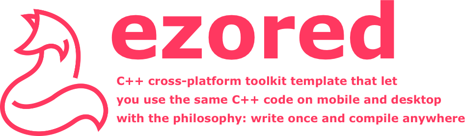
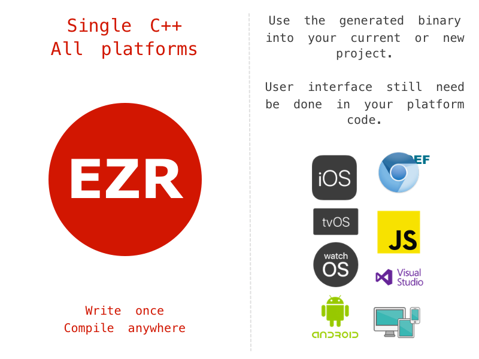

# ezored




[](https://travis-ci.org/ezored/ezored)
[](https://ci.appveyor.com/project/PauloCoutinho/ezored)

## About

**Code reuse. Write once. Run everywhere.**

C++ boostrap toolkit for multi-platform code reuse, including mobile and desktop.

Ezored was designed to have a convenient and organized struture of scripts and folders, so you can download this repository and start build sample files to test and see it working now.

Basically you build shared libraries for mobile (android is **aar** and ios is **framework**) and **executables** for desktop (linux, mac, windows).

Don't think about how you will start your C++ project for mobile or desktop, use ezored as a bootstrap project.



**What ezored is:**

- Ready-to-use bootstrap toolkit to build and reuse C++ code for multi-platform.
- Scripts, files and folders well-organized to you only need add your things to continue.
- Mobile and desktop samples that use some C++ code that access database, make requests, parser json data, store preference data, show logger, work with string and datetime.
- Easy and ready way that you can start create everything in C++ (you can create native SDK for mobile, command line tools, http server applications for API and everything more).
- Progressive, that is, allows you to use in a project in progress. Maybe you want only a performance agressive thing in your SDK or executable.
- Toolkit with market used tools (python, cmake and conan).

**What ezored not is:**

- Interface or UI for mobile or desktop.
- New way to write applications with a custom and new tool on market.
- Dependency manager.

**Why you need use it?**

- Code reuse. Write once. Run everyone.
- Do not worry about the project organization or the structure of it, ezored is this, it is a complete and functional project for you to start any other.
- Generally you made a mobile application for each market platform (android, ios, smart tv etc). You need a team for each platform and each team will implement the same code of business logic on each platform. With ezored you can start create your business logic in C++ and compile one single code for all supported platforms, and the teams only need create UI and on button click call your C++ function.
- Every developer like command line tools and generally need write one. With ezored you have a sample of working CLI tool that use the same C++ code that mobile uses.
- HTTP server applications need have good performance and low memory usage, at the same time respond to a lot of requests. Use any C++ HTTP server framework with ezored to make your server applications.
- Drivers for database SQL or NO/SQL generally are made with C/C++, and with ezored you can easy use it and start create your greate application.

**Free for ever:**

You can use it for free, for any purpose, including commercial purposes.

Feel free to collaborate with ezored, creating or improving the project and modules.

## Supported platforms:

1. android
2. ios
3. macos
4. linux
5. windows

Obs: Generally any platform with C++ support will work too, like smart tvs and embeded hardwares.

## Modules:

A module in ezored is C++ implementation of one specific feature. And ezored come with some modules already implemented:

1. **datetime**
    Some functions to work with date and time.
2. **file helper**
    Helper functions to work with files (write, read, create folder, delete files etc).
3. **http client**
    A http client to make http and https requests.
4. **logger**
    Logger functions to show messages with different levels.
5. **shared data**
    Shared data storage (android = shared preferences, ios = NSUserDefaults)
6. **string helper**
    Some string helper functions.
7. **sqlite3**
    SQLite3 come with ezored and let you use the same database on all platforms. Internally you can check our migration implementation. A library called "sqlitecpp" is used too, and make the job more easy.
8. **rapidjson**
    RapidJSON is used to parsing json from remote requests in ezored samples. It works on all tested platforms nice and fast.
9. **support lib**
    Mobile modules use djinni, and for mobile (Android and iOS) this module is used to make the bridge between codes works. Maybe your project don't need it, but current code use it instead of generate bridge files manually.

Modules source code are stored in **"files/djinni"** and **"files/src"**.

## Targets:

A target in ezored contains all files, config and scripts to build C++ code to the platform. You can see on folder **"files/targets"**.

Currently all targets use cmake structure to compile all. So each target has their own **CMakeLists.txt** file inside target folder **"cmake"**.

Generally all targets shared the same C++ code and because of this ezored has a commom **CMakeLists.txt** file inside folder **"files/cmake/common"**. Some targets add more source files, **"android_aar"** add their JNI files and "ios_framework" add their OBJC files.

A target has their **"verbs"**, that can be any file name **"build"**, **"package"** etc. All verbs are store inside **"verbs"** folder of a target and the file name will be use to find it when you call on terminal. Example:

```python make.py target android_aar build```

It will execute bootstrap file of ezored, that will do some validations and will search for a file with the path **"files/targets/android_aar/verbs/build.py"** and will send all parameter to a function called "run" inside it.

If you don't remember what verbs are available for a target you can type only this to list all verbs:

```python make.py target android_aar```

## Commands:

A command in ezored is a python file too and a function inside it that will receive all command line arguments use. Example:

```python make.py clean```

With this command ezored will search for a file with path **"files/commands/clean/clean.py"** and will send all parameter to a function called **"run"** inside it.

If you don't remember what commands are available you can type only this to list all commands:

```python make.py```

## Requirements:

**The general requirements is:**

1. Python (https://www.python.org/)
2. cmake (https://cmake.org/)
3. conan (https://conan.io/)

They are the basic things to make ezored work. Check on terminal if you have every tool in your path typing their names (python, cmake, conan).

Each platform requirements list now. Maybe you already have it, because are basic tools.

**Android Requirements:**

1. NDK supported operational system: macOS, Linux or Windows.  
    Conan will download NDK and other things to build based on your system.

**iOS Requirements:**

1. macOS operational system.
2. Xcode.
3. Command line tools.  
    Run: ```xcode-select --install```

**macOS Requirements:**

1. macOS operational system.
2. Xcode.
3. Command line tools.  
    Run: ```xcode-select --install```
4. macOS system headers.  
    Run: ```open /Library/Developer/CommandLineTools/Packages/macOS_SDK_headers_for_macOS_10.14.pkg```  
    The path can change for each macOS version (10.14 is mojave) and this is required because old softwares search on old places for this headers, like old openssl versions.

**Linux Requirements:**

1. Linux operational system.
2. C++ compiler installed.  
    Obs: On Ubuntu run on terminal ```sudo apt install build-essential```.

**Windows Requirements:**

1. Windows operational system.
2. Visual Studio installed.  
    Obs 1: Current example in ezored is using version 2017 (15), change for your needs in conan profile.  
    Obs 2: Everything was compiled using community version (https://visualstudio.microsoft.com/vs/community/).  
    Obs 3: On installation process select "Desktop development with C++".  

## How to use:

1. Clone reposity:
> git clone git@github.com:ezored/ezored.git

2. Enter on cloned folder:
> cd ezored

3. Test it with the following command that show bootstrap menu:
> python make.py

4. Install conan profiles:
> python make.py conan install_profiles

5. Now all commands are available. run the following command to list all targets that you can build:
> python make.py target

Example: If you are on **Linux**, you can build the **linux_app** target, if on **macOS** you can run **macos_app** target and if on **Windows** you can run **windows_app**.

> python make.py target linux_app conan  
> python make.py target linux_app build  
> python make.py target linux_app package  

**Obs:**

1. After run this commands above, a folder called **"dist"** will be created with compiled binaries of applications. The rule is the same for other targets.
2. The execution order is important. Before build your targets, install conan dependencies, build it and finally package. Package verbs will copy files to a non versioned folder called **"dist"** in root path.
3. You don't need run conan verb everytime, only run if you never run it before or if you change configuration, added dependencies, changed dependency version or other things that need call conan to rebuilt your dependencies.
4. Conan profiles are required to specify basic environment profile things to build targets, but some settings are changed while build, like **arch** and **build_type**.
5. Check requirements for each target. Example: iOS target require that you have a macOS system.

## Dist folder prebuilt

The folder containing all prebuilt things (android, ios, windows, macos and linux) are not versioned, but you can download a full version here:

> http://public.ezored.com/ezored/precompiled/dist.zip

Unzip it and put on your root folder. After it you can execute all desktop apps and all mobile apps.

## Djinni

Almost all modules use djinni to generate bridge files between C++ and mobile platform code (Android and iOS - Java, JNI, ObjC and ObjC++ files).

If you want create more modules, ezored come with a easy way to do it. Only duplicate any folder inside **"files/djinni"** and change files:

- proj.djinni
- generate.py

The file **"proj.djinni"** contain all interface things to be generated and file **"generate.py"** contain the script that will call djinni passing all required params, only change the params (package name, namespace etc).

After create your new djinni module folder, add it to the list, in your prefered order, inside file **"files/djinni/modules.py"**. We need it because when you import other djinni yaml file for reference, you need generate imported file before, so the current order generate isolated modules before modules that will require it.

If you will use djinni to generate files follow these steps:

1. Download djinni (https://github.com/dropbox/djinni).
2. Set environment var **DJINNI_HOME** as the root folder of djinni (where you cloned or downloaded it).

If you don't will use djinni in your project, ignore **djinni** section, because some people prefer create the bridge files manually.

## Clang tools

Ezored has support for **clang-format** tool and **"clang"** command is available.

To format all supported files, run the following command:  
> python make.py clang format  

You will see the list of formatted files.

If you don't have **clang-format** installed and in your **path**, you will be notified with an error.

## Projects:

We have some samples inside "projects" folder.

Android sample can be download here:
https://play.google.com/store/apps/details?id=com.ezored.sample

## Supported By Jetbrains IntelliJ IDEA


## License

[MIT](http://opensource.org/licenses/MIT)

Copyright (c) 2019-present, Paulo Coutinho