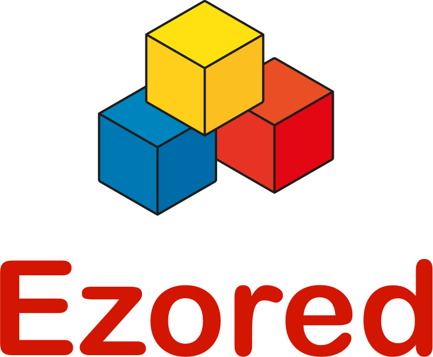
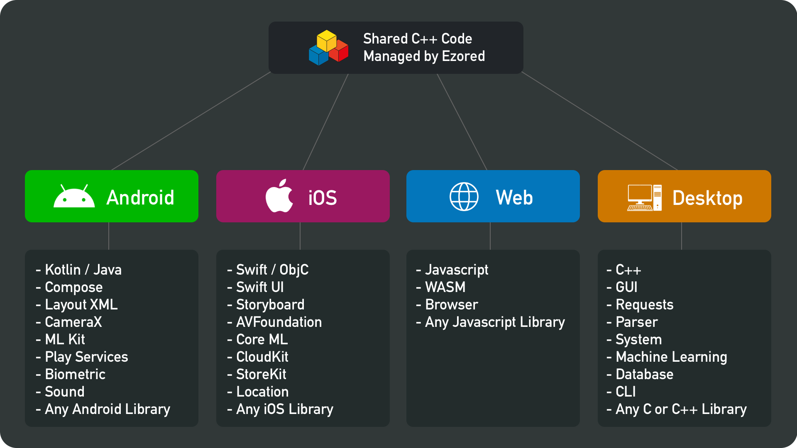

    
     
     
    C++ Multiplatform Toolkit Template
     
    Ezored Philosophy: Write Once And Compile Anywhere
     

 

    
    
    
    
    
    

## About

Single codebase for the business logic with Ezored.

Ezored multiplatform toolkit template allows you to use a single codebase for the business logic of mobile and desktop apps.

You only need to write platform-specific code where it’s necessary, for example to implement a native UI or when working with platform-specific APIs.

    

## Template

This template aim to let you thinking about your project code instead of it structure and organization.

Download this template and check samples to test and see it working on mobile and desktop.

Every command to setup, prepare, publish and generate final binary can be executed from command line and you can use any editor to work with Ezored.

Each piece of code is separated by modules, making easy extend with your custom code or any C++ code and library.

## Documentation

You can read all about Ezored in the auto-generated documentation:

[https://ezored.s3.amazonaws.com/docs/index.html](https://ezored.s3.amazonaws.com/docs/index.html)

## Demo

The Android sample can be downloaded here:

[https://play.google.com/store/apps/details?id=com.ezored.sample](https://play.google.com/store/apps/details?id=com.ezored.sample)

The iOS (also watchOS and macOS) sample can be downloaded here:

[https://apps.apple.com/br/app/ezored-c-tasks/id1492446109](https://apps.apple.com/br/app/ezored-c-tasks/id1492446109)

## Buy me a coffee

## License

[MIT](http://opensource.org/licenses/MIT)

Copyright (c) 2019-2021, Paulo Coutinho
