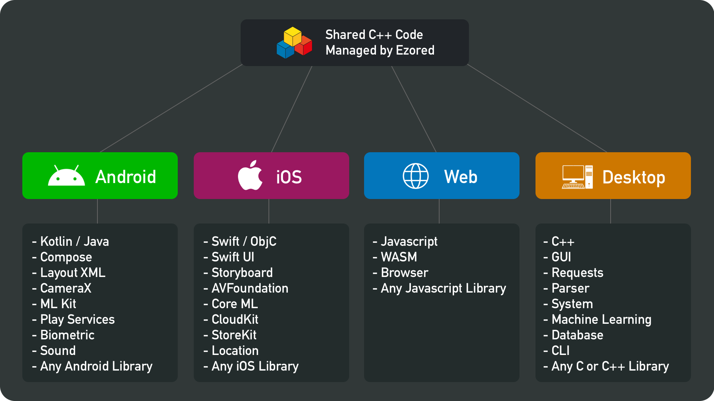

# Home

    
     
     
    C++ Multiplatform Toolkit Template
     
    Ezored Philosophy: Write Once And Compile Anywhere
     

 

    

 

## Source code

You can download Ezored source here:

[https://github.com/ezored/ezored](https://github.com/ezored/ezored)

## Demo

The Android sample can be downloaded here:

[https://play.google.com/store/apps/details?id=com.ezored.sample](https://play.google.com/store/apps/details?id=com.ezored.sample)

The iOS (also watchOS and macOS) sample can be downloaded here:

[https://apps.apple.com/br/app/ezored-c-tasks/id1492446109](https://apps.apple.com/br/app/ezored-c-tasks/id1492446109)

## Versions

* iOS: {{ ios_version }}
* Android: {{ android_version }}
* Linux: {{ linux_version }}
* macOS: {{ macos_version }}
* Windows: {{ windows_version }}
