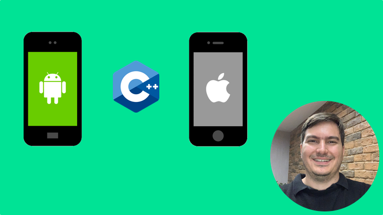

# Training

Udemy (portuguese): Crie aplicativos Android, iOS e Desktop de alta performance com C++ usando um único código multi-plataforma

[https://www.udemy.com/course/desenvolvendo-aplicativos-mobile-com-cpp-para-android-e-ios/](https://www.udemy.com/course/desenvolvendo-aplicativos-mobile-com-cpp-para-android-e-ios/)

